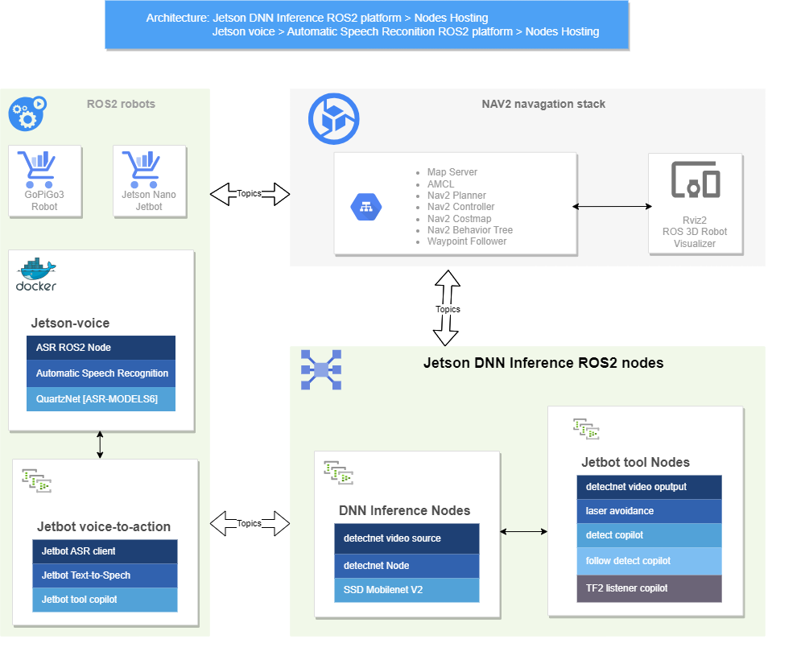

# Jetbot Voice to Action Tools with Jetson ASR Deep Learning Interface Library for ROS2 Robot

Jetbot Voice to Action Tools is a set of ROS2 nodes that utilize the Jetson Automatic Speech Recognition (ASR) deep learning interface library for NVIDIA Jetson. Jetbot Voice to Action Tools leverages the Jetson ASR ROS2 node for detecting robot task commands, enabling chat-based greetings, Lidar-assisted self-driving with object avoidance, and real-time object detection for following a person.

## Features

- **Jetbot ASR Client**: Enables your robot to decode human voice messages using the Jetson voice ASR ROS2 node.

- **Jetbot TTS Client**: Enables chat-based greeting text to be converted into speech and played via the robot's speaker. This feature enhances the interaction between the robot and humans, making it more engaging and user-friendly.

- **Voice to Action Map**: Allows you to build a map between specific voice commands and the corresponding actions that the robot should take.

- **Jetbot Voice Tools Copilot**: Executes the actions corresponding to the voice commands. It also handles tasks related to Lidar-assisted self-driving, object avoidance, and real-time object detection for person following.

#### Here is a brief overview of the jetbot tools design diagram/architecture

### Jetbot voice to actions tools source code and video demos:
---
- **Jetbot ASR Client:**
  - Code logic explanation:
    - Employs the Jetson voice Automatic Speech Recognition (ASR) ROS2 node and the [QuartzNet-15x5](https://docs.nvidia.com/deeplearning/nemo/user-guide/docs/en/stable/asr/models.html#quartznet) model to decode human speech into text. The decoded text is then published as ROS2 Text messages.
      - **Running the code:** Please note that this code needs to be run within a Docker container
        - Update [run.sh](https://github.com/dusty-nv/jetson-voice/blob/master/docker/run.sh) script by adding "[sudo docker run -env](https://docs.docker.com/engine/reference/commandline/container_run/) ROS_DOMAIN_ID=0". This command sets the ROS_DOMAIN_ID environment variable to 0 for ROS2 nodes running inside a jetson_voice Docker container.
        - cd jetson-voice
        - $docker/run.sh --dev
        - examples/asr.py --list-devices
        - ros2 launch ./ros/launch/asr-ns.launch.py input_device:=11
          - added namespace='jetbot_voice' into [asr.launch.py](https://github.com/dusty-nv/jetson-voice/blob/master/ros/launch/asr.launch.py)
    - **Receiving Jetson-voice ASR ROS2 Messages:** The Jetbot ASR Client receives the ASR ROS2 message and identifies it as either a Jetbot tool action or a chat-only topic.
    - **Handling Chat-Only Topics:** For chat-only topics, retrieves the appropriate response and publishes it as a ROS2 text message to the Jetbot TTS client for audio playback
    - **Handling Jetbot Tool Actions:** For accepted Jetbot tool actions, publishes a ROS2 Jetbot tool command text message to the Jetbot voice tools copilot ROS client, triggering robot actions.
  - Source code:
    - [launch file: jetbot_ASR_TTS.launch.py](launch/jetbot_ASR_TTS.launch.py)  
    - [ROS2 node: jetbot_ASR_Client.py](jetbot_voice/script/jetbot_ASR_Client.py)  
  - Usage:
    - ros2 run jetbot_voice audio_list
      - Get audio/microphone device ID
    - ros2 launch jetbot_voice jetbot_ASR_TTS.launch.py param_file:=./jetbot_voice/param/jetbot_voice_params.yaml output_device:=11
- **Jetbot TTS Client**
  - Code logic explanation:
    - The Jetbot TTS Client is designed to convert text into audio, thereby enabling robots to communicate vocally
    - It utilizes the Google Text-to-Speech library to generate an MP3 streaming file, which is then played through the robot’s speaker
    - The client can convert chat-based greeting text into speech, enhancing the interaction between the robot and humans. This feature makes the robot more engaging and user-friendly
  - Source code:
    - [launch file: jetbot_ASR_TTS.launch.py](launch/jetbot_ASR_TTS.launch.py)  
    - [launch file: jetbot_TTS.launch.py](launch/jetbot_TTS.launch.py)  
    - [ROS2 node: jetbot_TTS_Client.py](jetbot_voice/script/jetbot_TTS.py)  
  - Usage:
    - ros2 run jetbot_voice audio_list
      - Get speaker device ID
    - ros2 launch jetbot_voice jetbot_ASR_TTS.launch.py param_file:=./jetbot_voice/param/jetbot_voice_params.yaml output_device:=11
    - ros2 launch jetbot_voice jetbot_TTS.launch.py param_file:=./jetbot_voice/param/jetbot_TTS_params.yaml output_device:=11
- **Jetbot Voice Tools Copilot:**
  - Code logic explanation:
    - **Voice to Action Mapping:** Upon initialization, the Jetbot Voice Tools Copilot constructs a Voice to Action map. This map establishes a comprehensive relationship between specific voice commands and the corresponding actions the robot should execute.
    - **Action Execution:** The Jetbot Voice Tools Copilot executes the actions corresponding to the voice commands published via the Jetbot ASR Client ROS2 node
      - **Supported Action Management:** It effectively handles the starting and stopping of Jetbot tool-supported actions, encompassing functionalities such as:
        - **Self driving:** Lidar-assisted ovject avoidance self-driving
        - **Person following:** Real-time object detection for person following
        - **Navigation:** Move forward/backward, turn left/right
  - Source code:
    - [launch file: jetbot_tools_voice.launch.py](launch/jetbot_tools_voice.launch.py)  
    - [param file: jetbot_voice_params.yaml](param/jetbot_voice_params.yaml)  
    - [ROS2 node: jetbot_tools_sopilot.py](jetbot_voice/script/jetbot_tools_copilot.py)  
  - Usage:
    - ros2 launch jetbot_voice jetbot_tools_voice.launch.py param_file:=./jetbot_voice/param/jetbot_voice_params.yaml  
  
  ### Requirements:
- Jetson Nano:
  - Ububnu 20.04: https://qengineering.eu/install-ubuntu-20.04-on-jetson-nano.html
  - ROS2 foxy: https://docs.ros.org/en/foxy/index.html
  - Jetson voice ASR deep learining inference library: https://github.com/dusty-nv/jetson-voice
  - Jetson voice ASR ROS2 node: https://github.com/dusty-nv/jetson-voice/tree/master/ros
  - Docker container: https://www.forecr.io/blogs/installation/how-to-install-and-run-docker-on-jetson-nano
  - Jetson inference and realtime vision DNN library: https://github.com/dusty-nv/jetson-inference
  - Jetson Inference Nodes for ROS2: https://github.com/dusty-nv/ros_deep_learning  
  - Google Text-to-Speech: https://gtts.readthedocs.io/
  - ROS2 Jetbot Rools: - https://github.com/Jen-Hung-Ho/ros2_jetbot_tools
- Robot:
  - Jetson Nano Jetbot: https://www.waveshare.com/wiki/JetBot_ROS_AI_Kit
    - https://github.com/waveshare/jetbot_pro  
  
  ### References
- https://qengineering.eu/install-ubuntu-20.04-on-jetson-nano.html
- https://docs.ros.org/en/foxy/index.html
- https://navigation.ros.org/
- https://github.com/Jen-Hung-Ho/ros2_jetbot_tools
- https://github.com/dusty-nv/jetson-inference
- https://github.com/dusty-nv/ros_deep_learning
- https://github.com/dusty-nv/jetson-voice
- https://github.com/dusty-nv/jetson-voice/tree/master/ros
- https://www.forecr.io/blogs/installation/how-to-install-and-run-docker-on-jetson-nano
- https://gtts.readthedocs.io/
