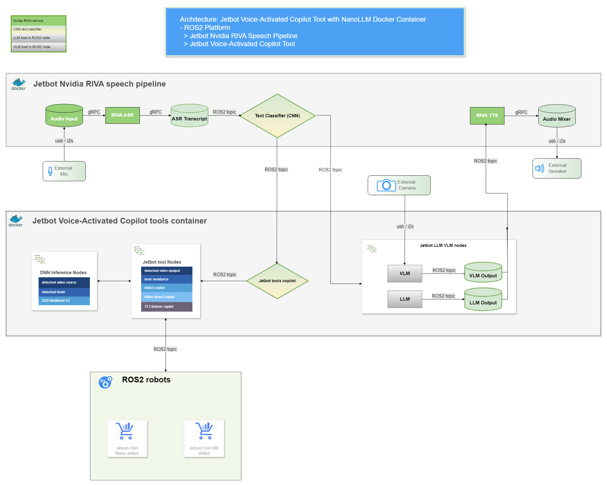

# Jetbot Voice-Activated Copilot Tools with Nvidia RIVA and NanoLLM Container for ROS2 Robot - version 2.0

Jetbot Voice-Activated Copilot is a set of ROS2 nodes that utilize the NVIDIA RIVA Automatic Speech Recognition (ASR) deep learning interface library and the Jetson NanoLLM Docker container for NVIDIA Jetson Orin jetbot. These tools leverage NVIDIA RIVA ASR for input and use a 1D convolutional neural network (CNN) model as a text classifier to handle the prediction process for robot task commands. This enables functionalities such as chat via LLM, vision via VLM, Lidar-assisted self-driving with object avoidance, and real-time object detection for following a person.

### Features
---
- **Jetbot ASR Processor**: Enables your robot to decode human voice messages using the [Nvidia RIVA ASR service](https://docs.nvidia.com/deeplearning/riva/user-guide/docs/asr/asr-overview.html) client ROS2 node.

- **Jetbot TTS Processor**: Converts chat-vision NLM VLM response text into speech using [Nvidia RIVA TTS services](https://docs.nvidia.com/deeplearning/riva/user-guide/docs/tts/tts-overview.html), which is then played via the robot's speaker. This feature enhances the interaction between the robot and humans, making it more engaging and user-friendly.

- **Jetbot ASR Agent**: Allows you to build a simple 1D convolutional neural network (CNN) model for [text classification](https://keras.io/examples/nlp/text_classification_from_scratch/) to predict human voice intentions and pipe corresponding NLM chat, VLM vision, and actions that the robot should take.

- **Jetbot Voice Tools Copilot**: Executes the actions corresponding to the voice commands posted via ROS2 topic from the Jetbot ASR Agent. It also handles tasks related to Lidar-assisted self-driving, object avoidance, and real-time object detection for person following.

#### Here is a brief overview of the jetbot tools design diagram/architecture

### Setup
- [Jetbot Voice-Activated Copilot Tools Setup Guide](docs/setup.md#setup)
  

### Jetbot voice-activated copilot tools source code and video demos
---
- **Jetbot ASR Processor:**
  - Code logic explanation:
    - Employs the Nvidia RIVA Speech Recognition (ASR) service client side ROS2 node to decode human speech into text. The decoded text is then published as ROS2 Text messages.
      - **Start Nvidia RIVA server:** [Riva Server Quick Start Guide](https://docs.nvidia.com/deeplearning/riva/user-guide/docs/quick-start-guide.html)
         - `cd riva_quickstart_v2.16.0`
         - `bash riva_init.sh`
         - `bash riva_start.sh`
      - **Running the code:** Please note that this code needs to be run within a Docker container
        - `cd ros2_jetbot_voice`
        - `. run.sh `
        - `python3 /opt/riva/python-clients/scripts/list_audio_devices.py` 
        - `ros2 run jetbot_riva_voice jetbot_ASR --ros-args --params-file /ros2_ws/src/param/jetbot_voice_params.yaml`
    - **Receiving Nvidia RIVA ASR service Messages:** The Jetbot ASR Processor processes the user message and identifies it as either a Jetbot tool action or a chat-vision message.
    - **Handling and publish Chat-Only message to LLM:** For chat-only topics, publish ROS2 topic message to the [LLM](https://huggingface.co/meta-llama/Llama-2-7b-chat-hf) ROS2 node hosted in Jetbot tools and mute the mic to prevent TTX audio playback causing an echo effect.
    - **Handling and publish Vision message to VLM:** For vision topics, publish ROS2 topic message via the [VLM](https://huggingface.co/Efficient-Large-Model/VILA1.5-3b) ROS2 node host in Jetbot tools and mute the mic to prevent TTX audio playbak causing an echo effect.
    - **Handling Jetbot Tool Actions:** For accepted Jetbot tool actions, publish a ROS2 Jetbot tool command text message to the Jetbot voice tools copilot ROS2 client, triggering robot actions.
  - Source code:
    - [param file: jetbot_voice_params.yaml](jetbot_riva_voice/param/jetbot_voice_params.yaml)  
    - [ROS2 node: jetbot_ASR_Processor.py](jetbot_riva_voice/jetbot_riva_voice/script/Jetbot_ASR_Processor.py)  
  - Usage:
    - `python3 /opt/riva/python-clients/scripts/list_audio_devices.py`
      - Get audio/microphone device ID
    - `ros2 run jetbot_riva_voice jetbot_ASR --ros-args --params-file /ros2_ws/src/param/jetbot_voice_params.yaml`
- **Jetbot TTS Processor:**
  - Code logic explanation:
    - The Jetbot TTS Client is designed to convert text into audio, thereby enabling robots to communicate vocally
    - It utilizes the NVIDA RIVA TTX service, which is then played through the robot’s speaker
    - The client can convert chat-based greeting text into speech, enhancing the interaction between the robot and humans. This feature makes the robot more engaging and user-friendly
  - Source code:
    - [param file: jetbot_voice_params.yaml](jetbot_riva_voice/param/jetbot_voice_params.yaml)  
    - [ROS2 node: jetbot_TTS_Processor.py](jetbot_riva_voice/jetbot_riva_voice/script/Jetbot_TTS_Processor.py)  
  - Usage:
    - `python3 /opt/riva/python-clients/scripts/list_audio_devices.py`
      - Get speaker device ID
    - `ros2 run jetbot_riva_voice jetbot_TTS --ros-args --params-file /ros2_ws/src/param/jetbot_voice_params.yaml -p index:=11`
- **Jetbot ASR Agent:**
  - Code logic explanation:
    - **Voice to Action Mapping:** Upon initialization, the Jetbot ASR Agent lazily loads a simple pre-trained 1D convolutional neural network (CNN) model. It then uses the model's labels file to construct a Voice to Action map. This map establishes a comprehensive relationship between specific voice messages or commands and the corresponding actions the robot should execute.
    - **CNN mode voice message predition:** The CNN model's message prediction label and score are used to find the Voice to Action map to determine whether the message is for chat, vision, or robot commands. The voice and vision messages are published via ROS2 topics to the LLM and VLM ROS2 nodes hosted in Jetbot tools.
    - **Action Execution:** The Jetbot Voice Tools Copilot executes the actions corresponding to the voice commands published via the Jetbot ASR Client ROS2 node.
      - **Supported Action Management:** It effectively handles the starting and stopping of Jetbot tool-supported actions, encompassing functionalities such as:
        - **Self driving:** Lidar-assisted ovject avoidance self-driving
        - **Person following:** Real-time object detection for person following
        - **Navigation:** Move forward/backward, turn left/right
  - Source code:
    - [param file: jetbot_voice_params.yaml](jetbot_riva_voice/param/jetbot_voice_params.yaml)  
    - [ROS2 node: Jetbot_ASR_Agent.py](jetbot_riva_voice/jetbot_riva_voice/script/Jetbot_ASR_Agent.py)  
  - Usage:
    - `ros2 run jetbot_riva_voice jetbot_voice_agent --ros-args --params-file /ros2_ws/src/param/jetbot_voice_params.yaml
`  
  
  ### Requirements:
- Jetson Orin Nano or Jetson Orin NX:
  - https://developer.nvidia.com/embedded/learn/get-started-jetson-agx-orin-devkit#what-youll-need
  - ROS2 humble: https://docs.ros.org/en/humble/index.html
  - NanoLLM Docker container: https://github.com/dusty-nv/NanoLLM
  - NanoLLM Docker container for ROS2: https://github.com/NVIDIA-AI-IOT/ros2_nanollm
  - ROS2 Jetbot Tools Docker container V 2.0 : - https://github.com/Jen-Hung-Ho/ros2_jetbot_tools
- Robot:
  - Jetson Orin Jetbot: http://www.yahboom.net/study/ROSMASTER-X3
    - https://drive.google.com/drive/folders/1QuXJcrRMs8oyTrrROKMnUNvTHImcIC78
  
  ### References
- https://www.releases.ubuntu.com/22.04/
- https://developer.nvidia.com/embedded/learn/get-started-jetson-agx-orin-devkit#what-youll-need
- https://docs.ros.org/en/humble/index.html
- https://navigation.ros.org/
- https://github.com/Jen-Hung-Ho/ros2_jetbot_tools
- https://github.com/dusty-nv/jetson-containers
- https://dusty-nv.github.io/NanoLLM/
- https://github.com/dusty-nv/NanoLLM
- https://github.com/NVIDIA-AI-IOT/ros2_nanollm
- https://www.jetson-ai-lab.com/tutorial_llamaspeak.html
- https://org.ngc.nvidia.com/setup/installers/cli
- https://docs.nvidia.com/deeplearning/riva/user-guide/docs/quick-start-guide.html
- https://docs.nvidia.com/deeplearning/riva/user-guide/docs/tutorials/tts-basics-customize-ssml.html?highlight=speechsynthesisservice
- https://keras.io/examples/nlp/text_classification_from_scratch/

